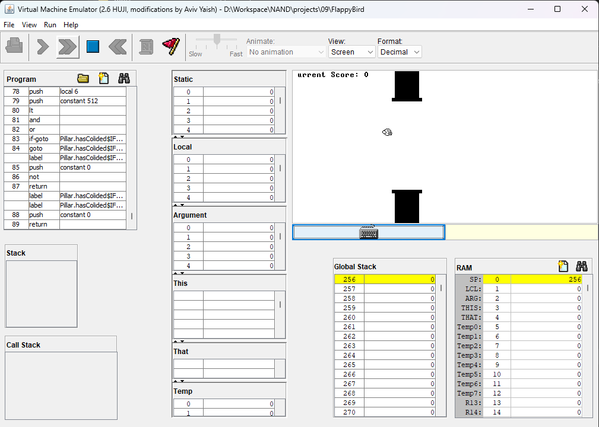
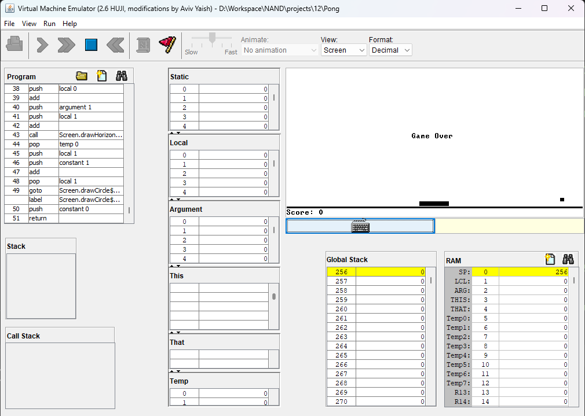

  
  <h1 align="center" style="border-bottom: none"><b>From Nand to Tetris</b></h1>

  

    As a Computer Science Student in the <a href="https://new.huji.ac.il/"><b>Hebrew University of Jerusalem</b></a>, I was required to take the <b>From Nand to Tetris</b> course.
     
    This is a course that teaches you about logic gates, hardware, compilers and operating systems, using <b>Python</b> as the main language.
     
    It lasted <b>13 weeks</b>, in which, we've submitted a total of 12 exercises in various fields and topics.
     
     
    More information can be found <a href="https://shnaton.huji.ac.il/index.php/NewSyl/67925/2/2022/">Here</a>.
  

 

  <h2 align="left" style="border-bottom: 1px solid gray">Exercises</h2>

  <ul align="left">
    <li><a href="./projects/01"><b>Exercise 1 - Boolean Logic »</b></a></li>
    <ul><li style="list-style: none;">⤷ Implementation of basic Logic Gates</li></ul>
     
    <li><a href="./projects/02"><b>Exercise 2 - Boolean Arithmetic »</b></a></li>
    <ul><li style="list-style: none;">⤷ Implementation of Arithmetic Chips</li></ul>
     
    <li><a href="./projects/03"><b>Exercise 3 - Sequential Logic »</b></a></li>
    <ul><li style="list-style: none;">⤷ Implementation of Sequential Chips</li></ul>
     
    <li><a href="./projects/04"><b>Exercise 4 - Machine Language »</b></a></li>
    <ul><li style="list-style: none;">⤷ Familiarization with the Nand2Tetris Machine Language</li></ul>
     
    <li><a href="./projects/05"><b>Exercise 5 - Computer Architecture »</b></a></li>
    <ul><li style="list-style: none;">⤷ Implementation of Computer Architecture Chips</li></ul>
     
    <li><a href="./projects/06"><b>Exercise 6 - Assembler »</b></a></li>
    <ul><li style="list-style: none;">⤷ Implementation of an Assembler, translating to Machine Language</li></ul>
     
    <li><a href="./projects/07"><b>Exercise 7 - Virtual Machine Translator (Part 1) »</b></a></li>
    <ul><li style="list-style: none;">⤷ Implementation of a VM translator for Arithmetic operations</li></ul>
     
    <li><a href="./projects/08"><b>Exercise 8 - Virtual Machine Translator (Part 2) »</b></a></li>
    <ul><li style="list-style: none;">⤷ Implementation of a VM translator for Functions and Program-Flow</li></ul>
     
    <li><a href="./projects/09"><b>Exercise 9 - High Level Programing »</b></a></li>
    <ul><li style="list-style: none;">⤷ Development of a game with the Jack language</li></ul>
     
    <li><a href="./projects/10"><b>Exercise 10 - Compilation (Part 1) »</b></a></li>
    <ul><li style="list-style: none;">⤷ Implementation of a Jack Compiler (XML Structured)</li></ul>
     
    <li><a href="./projects/11"><b>Exercise 11 - Compilation (Part 2) »</b></a></li>
    <ul><li style="list-style: none;">⤷ Implementation of a Jack Compiler</li></ul>
     
    <li><a href="./projects/12"><b>Exercise 12 - Operating System »</b></a></li>
    <ul><li style="list-style: none;">⤷ Implementation of a working, basic, Operating System</li></ul>
  </ul>

 

  <h2 align="left" style="border-bottom: 1px solid gray">Media</h2>

  

    
     
    
  

 

  <h2 align="left" style="border-bottom: 1px solid gray">Contributing</h2>

  

    Pull requests are welcome. For major changes, please open an issue first to discuss what you would like to change.
  

 

  <h2 align="left" style="border-bottom: 1px solid gray">License</h2>

  

    <a href="https://creativecommons.org/licenses/by-nc-sa/3.0/">Licensed under Creative Common Attribution-NonCommercial-ShareAlike 3.0 Unported License</a>
  

